# parseJSON2E
这是一个将JSON数据类型一键转换为易语言自定义数据类型的算法实现<br>
喜欢的给个star吧!欢迎贡献你的创意code!<br>

# 更新
v1.3 2019年4月12日<p>
已更新Json文件样例.<p>
[修复] 某些特殊JSON中key中包含斜线加减乘除等特殊字符的全部修改为'_'.<p>
[修复] 某些特殊JSON中存在空对象'{}'导致自动创建无成员数据类型的问题.<p>
[修复] 某些特殊JSON中存在对象实际引用地址不正确的问题.<p>
[改进] 代码格式tab缩进问题的修正.<p>
[改进] 算法优化.<p>

# 已完成进度:

1.转换JSON为易语言数据类型

2.生成一键读取JSON数据方法(基本做到一次编译通过!)

3.深度挖掘JSON文件,补全有些对象中有的key 有些对象中没有的key(未完成,暂时没空写)

# 特性:
1. 支持json内对象嵌套数组嵌套对象再嵌套数组,自动递归生成嵌套计次循环代码:<br>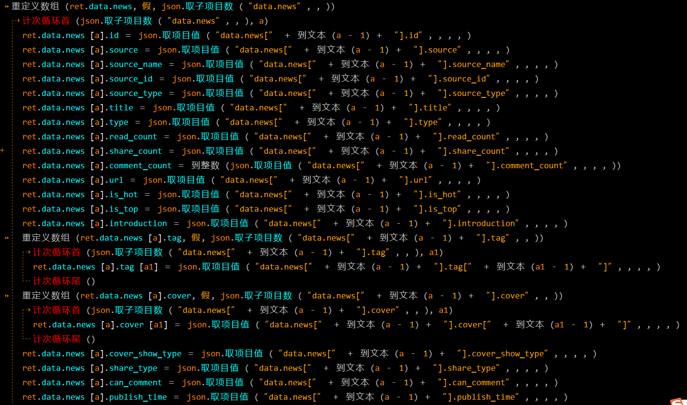
2. 自动计算动态更改计次循环 'i' 的变量名称.<br>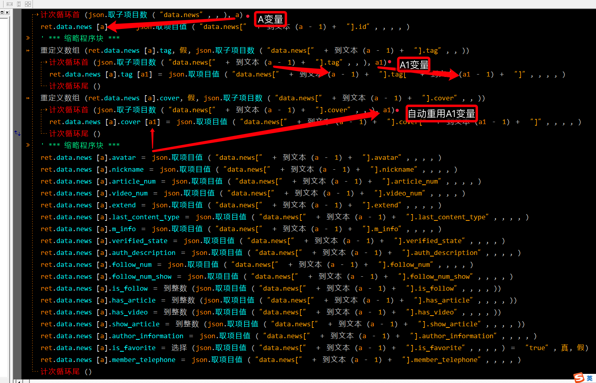
3. 配合配对的生成JSON数据类型方法可以实现懒人式数据读写<br>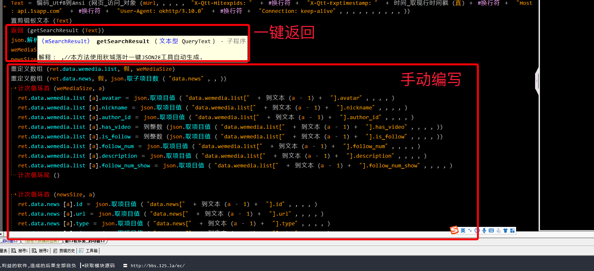<br>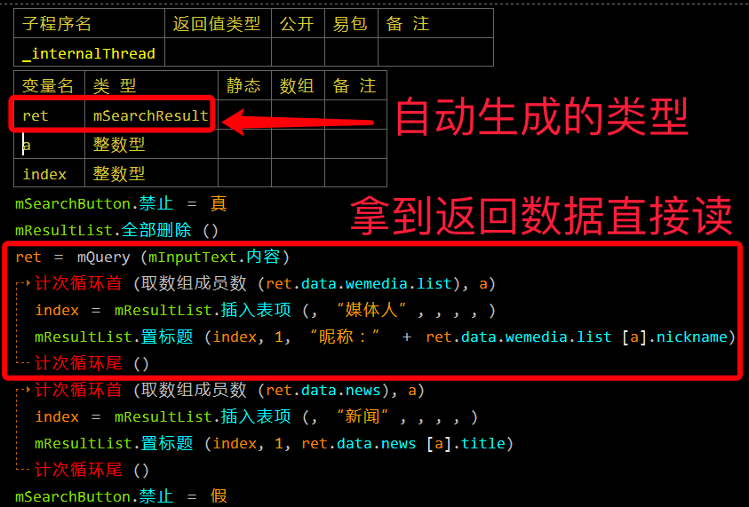

# 使用方法
提示:在线JS代码文件更新地址:https://raw.githubusercontent.com/QiuChenly/parseJSON2E/master/Eval.js
1. 复制JS代码.<br>
   文件: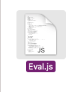
2. 粘贴到易语言常量.<br>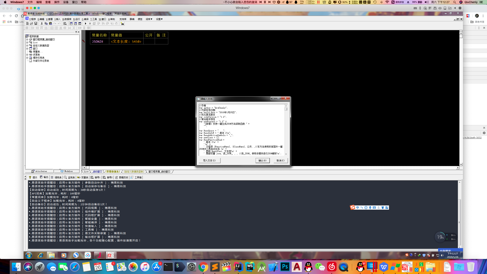
3. 编写类似如下JS方法.<br>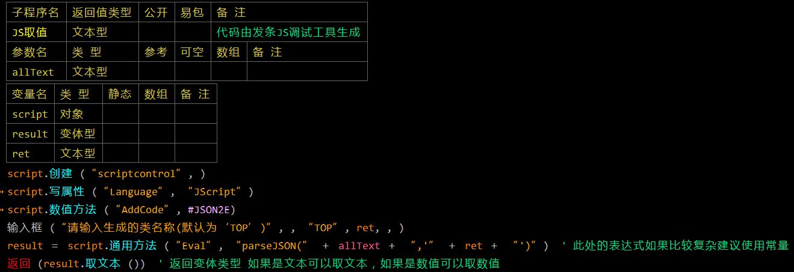
4. 易语言中设置执行对应的js方法即可.<br>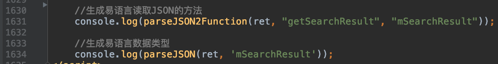
````
   方法调用说明(<>符号作为本文强调,调用时请删除<>符号.):
   //生成易语言读取JSON的方法
   parseJSON2Function(<你的JSON数据原文本>, '<生成的易语言方法名称>', '<要返回的易语言数据类型名>')
   
   //生成易语言数据类型
   parseJSON(<你的JSON数据原文本>, '<要生成的易语言数据类型名>')
````

# 我不想做上面这么复杂,有没有更快的方法?
1. 运行随附的落叶小工具源码或直接运行提供的编译版本软件.<br>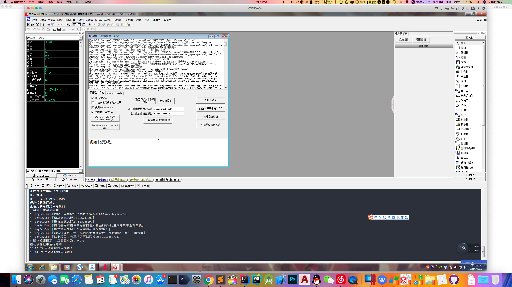
2. 输入json原文本并设置'欲生成的易语言方法名'和'欲生成的易语言数据类型名'.<br>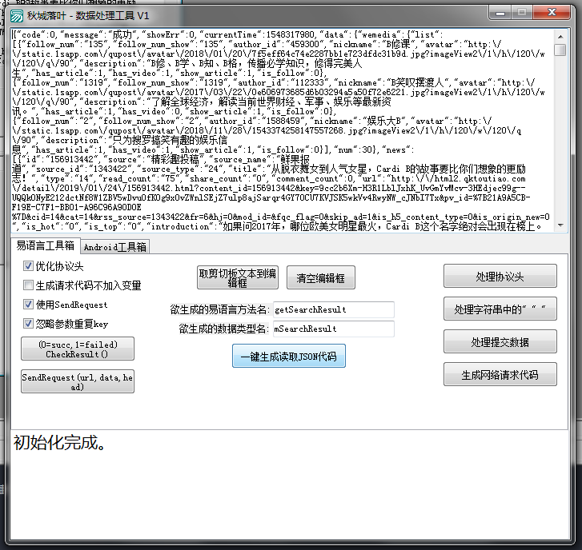
3. 点击'一键生成读取JSON代码'.
4. 在你的易语言代码中找到一个合适的位置开始粘贴.<br>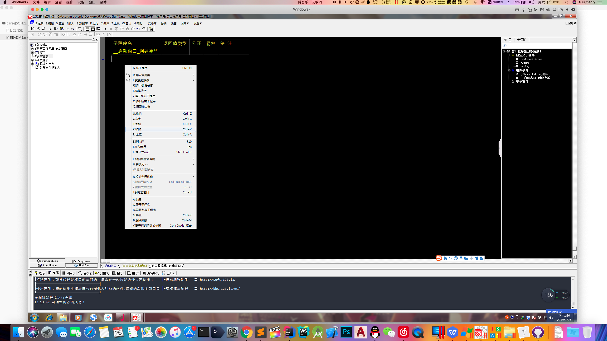<br>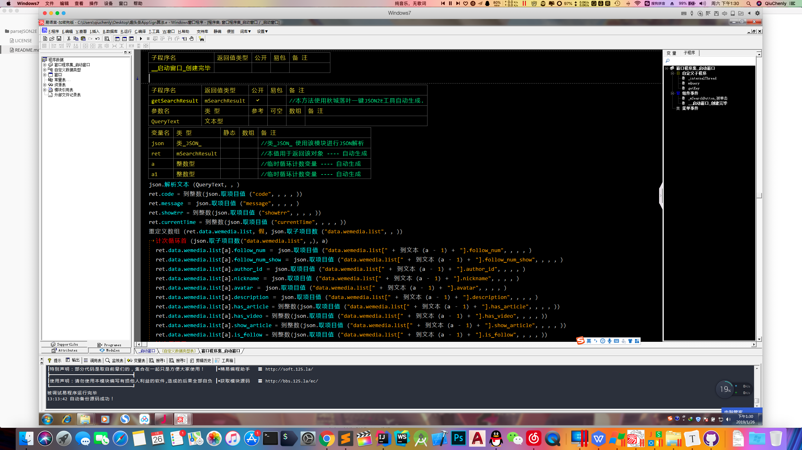<br>请仔细对比粘贴前后的细微差别.
5. 在http数据返回处开始调用,读取json指定数据犹如体验原生支持json调用的快感:<br>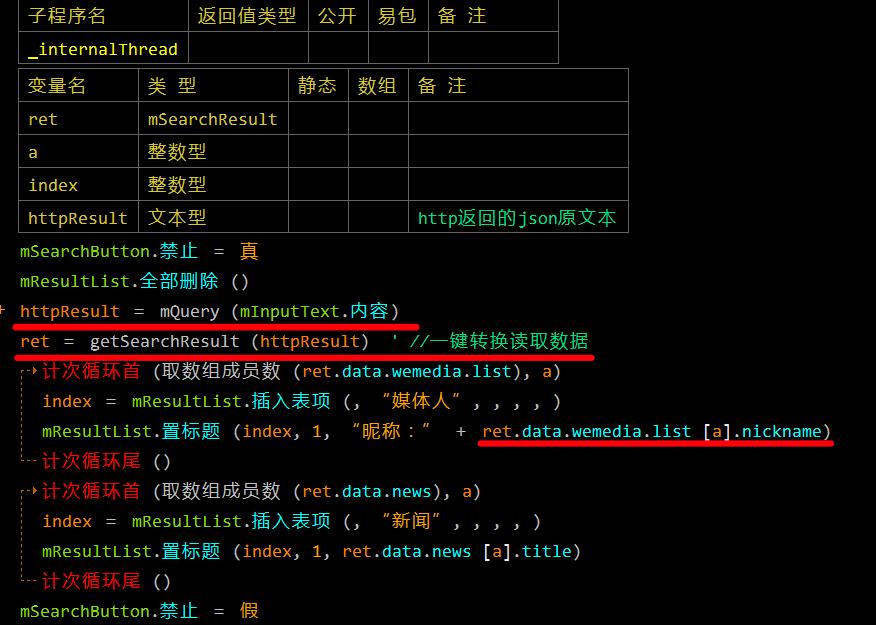

# 功能预览
## 自动生成的易语言数据信息
#### 图 1-1 
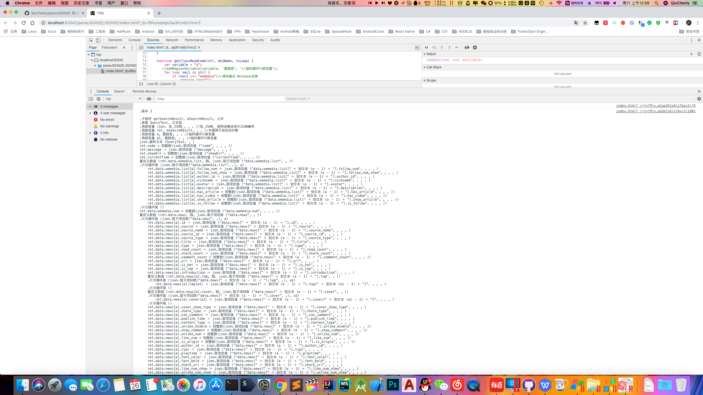

## 自动生成的易语言方法
#### 图 1-2 
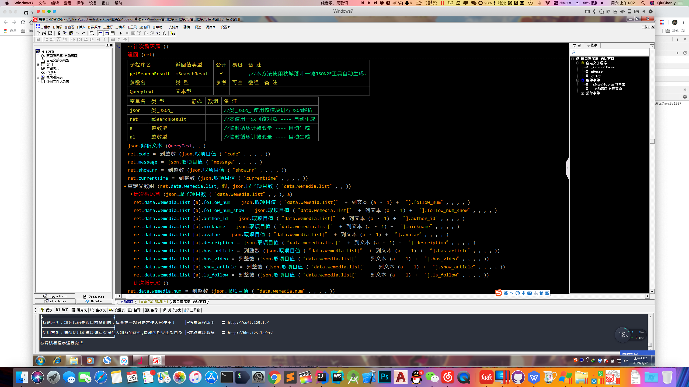

## 自动生成的易语言自定义数据类型 1
#### 图 1-3 
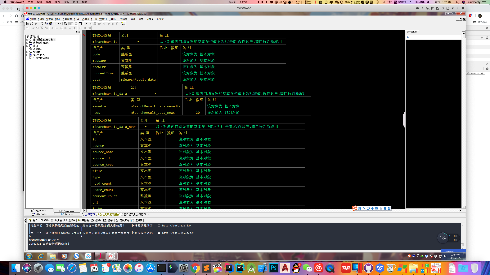

## 自动生成的易语言自定义数据类型与工具解析出来的信息对比
#### 图 1-4 
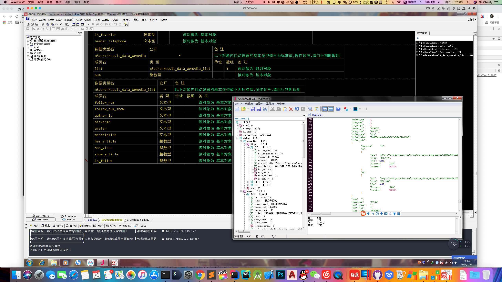